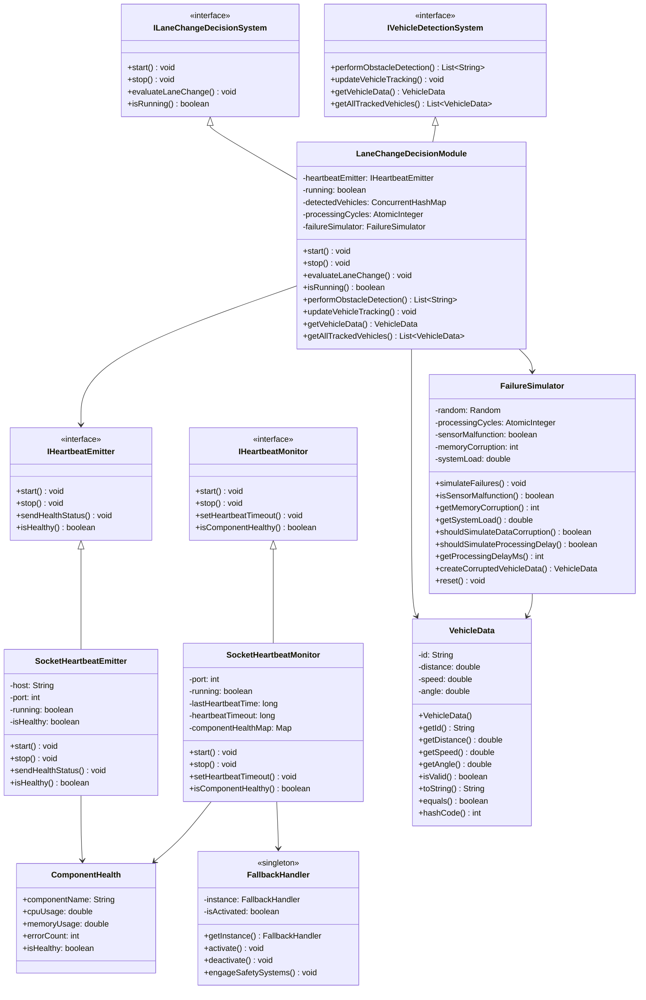
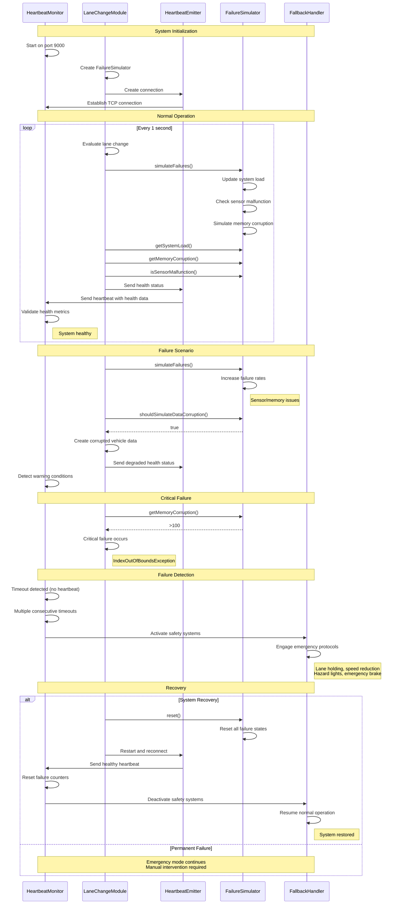

# Lane Change System with Heartbeat Monitoring

## Overview
This project implements an autonomous vehicle lane change system with comprehensive fault detection and heartbeat monitoring. The system demonstrates critical software functionality monitoring in a distributed environment using Java socket-based communication.

## How to run it

### What you need
- Java (I used Java 11 but newer versions should work)
- A terminal
- Probably want multiple terminal windows open

### Compiling everything
```bash
java -d out ./*/*.java
```

### Starting the system

#### Terminal 1 - Start the monitor first
```bash
cd out
java main.MonitorMain
```
You should see something like:
```
[MonitorMain] Starting heartbeat monitor...
[Monitor] Heartbeat timeout set to 2500ms
[Monitor] Health thresholds updated - CPU:85.0%, MEM:90.0%, ERR:4
[Monitor] Heartbeat monitoring started on port 9000
```

#### Terminal 2 - Start the lane change system
```bash
cd out
java main.LaneChangeMain
```
Should connect to the monitor and start sending heartbeats:
```
[LaneChangeModule] Starting obstacle detection module...
[Emitter] Connected to monitor at localhost:9000
[LaneChangeModule] Evaluating lane change...
[Monitor] Connection established from /127.0.0.1:xxxxx
[Monitor] Heartbeat received and analyzed
```

#### Terminal 3 - Optional test emitter
```bash
cd out
java -cp . main.EmitterMain
```

This just sends test data to see if the monitoring works.

## What's in here?

The code is split into a few parts:

**Main classes:**
- `LaneChangeMain` - The main system that does the lane change logic
- `MonitorMain` - Watches for heartbeats and detects failures  
- `EmitterMain` - Just for testing, sends fake health data

**Interfaces:**
- `ILaneChangeDecisionSystem` - Contract for lane change stuff
- `IVehicleDetectionSystem` - Contract for detecting other cars
- `IHeartbeatEmitter/IHeartbeatMonitor` - Heartbeat communication

**The actual implementations:**
- `LaneChangeDecisionModule` - Does the actual lane change decisions and vehicle detection
- `FailureSimulator` - Simulates various things going wrong (sensors failing, memory corruption, etc.)
- `VehicleData` - Just holds info about detected vehicles
- `SocketHeartbeatEmitter/Monitor` - Handle the network communication
- `FallbackHandler` - Emergency fallback when things go really wrong

## How it works

The basic idea is:
1. Monitor starts and listens on port 9000
2. Lane change system connects and starts sending heartbeats every second
3. Each heartbeat includes CPU usage, memory usage, and error count
4. The FailureSimulator gradually makes things worse over time
5. Eventually something fails badly enough that the monitor notices
6. Monitor activates emergency mode

## What happens when you run it

**First minute or so:** Everything looks normal
```
[Monitor] Heartbeat received and analyzed
[LaneChangeModule] Evaluating lane change...
[Monitor] Stats - Total: 30, Missed: 0, Reliability: 100.00%
```

**After a couple minutes:** Things start going wrong
```
[FailureSimulator] WARNING: Sensor malfunction detected!
[FailureSimulator] WARNING: Memory corruption level: 65
[Monitor] WARNING: Component LaneChangeModule exceeds health thresholds
```

**Eventually:** Everything breaks
```
[LaneChangeModule] CRITICAL FAILURE: IndexOutOfBoundsException
[Monitor] EMERGENCY: No heartbeat received for 5+ seconds
[FallbackHandler] EMERGENCY MODE ACTIVATED
```

## What gets monitored

The system tracks a few basic health metrics:
- CPU usage (fails if over 85%)
- Memory usage (fails if over 90%)
- Error count (fails if more than 4 errors)
- Whether the component is responding at all

If heartbeats stop coming for 2.5 seconds, the monitor assumes something is wrong. If it keeps happening, it activates the fallback system.

You'll get status reports every 15 seconds or so showing how many heartbeats were received vs missed.


## Communication

The different parts talk to each other using TCP sockets on port 9000.

If the connection drops, the emitter tries to reconnect automatically.


## What libraries it uses

- `java.net` for sockets
- `java.io` for reading/writing
- `java.util.concurrent` for thread-safe operations
- `java.util` for basic collections and random numbers


## Diagrams

### Class Diagram



### Sequence Diagram





## Files and directories
```
├── README.md                              # Project documentation
└── src/
    ├── main/
    │   ├── LaneChangeMain.java           # Primary application
    │   ├── MonitorMain.java              # Monitoring process
    │   └── EmitterMain.java              # Standalone emitter
    ├── lanechange/
    │   ├── ILaneChangeDecisionSystem.java # Lane change interface
    │   ├── IVehicleDetectionSystem.java  # Vehicle detection interface
    │   ├── LaneChangeDecisionModule.java # Main decision module
    │   ├── VehicleData.java              # Vehicle data model
    │   └── FailureSimulator.java         # Failure simulation component
    ├── heartbeat/
    │   ├── IHeartbeatEmitter.java        # Heartbeat emitter interface
    │   ├── IHeartbeatMonitor.java        # Heartbeat monitor interface
    │   ├── SocketHeartbeatEmitter.java   # TCP heartbeat emitter
    │   └── SocketHeartbeatMonitor.java   # TCP heartbeat monitor
    └── fallback/
        └── FallbackHandler.java          # Emergency fallback system
```


